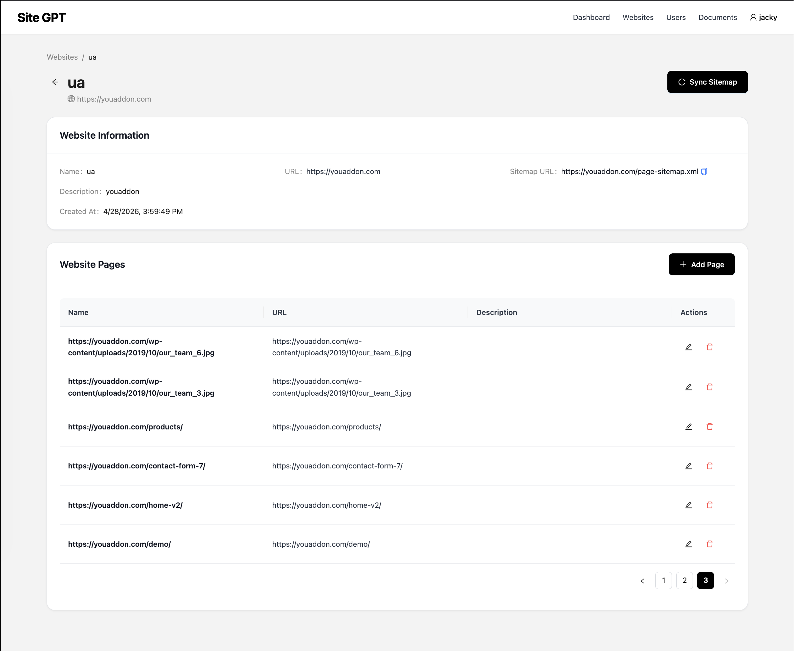

# SiteGPT

SiteGPT is a system auto generate to Chat Bot for company. It allows users to create and manage their own websites, extra documents, and use them to create a Chat Bot.

## Features

- User authentication and management
- Website management
- Extra document management for additional information
- Use Website information and Extra Document to create a Chat Bot

## Installation

- Clone the repository
- Create database
- Install and config redis
- Config .env: copy from .env.example
- Install poetry
- Run `poetry install`
- Run `poetry run alembic upgrade head` to apply database migrations
- Run `poetry run uvicorn src.site_gpt.app.main:app`
- Run `poetry run python -m src.site_gpt.app.worker` to start the worker

## Development

- Create migration `poetry run alembic revision --autogenerate -m "[name]"`
- Run `poetry run alembic upgrade head` to apply database migrations
- Run `poetry run uvicorn src.site_gpt.app.main:app --reload` to start the development server
