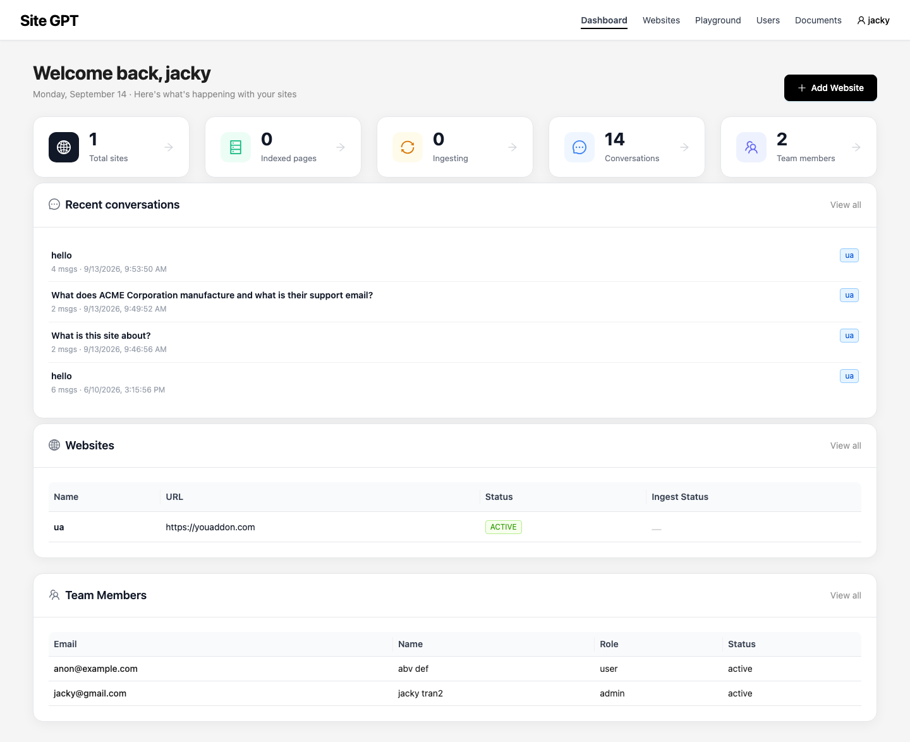
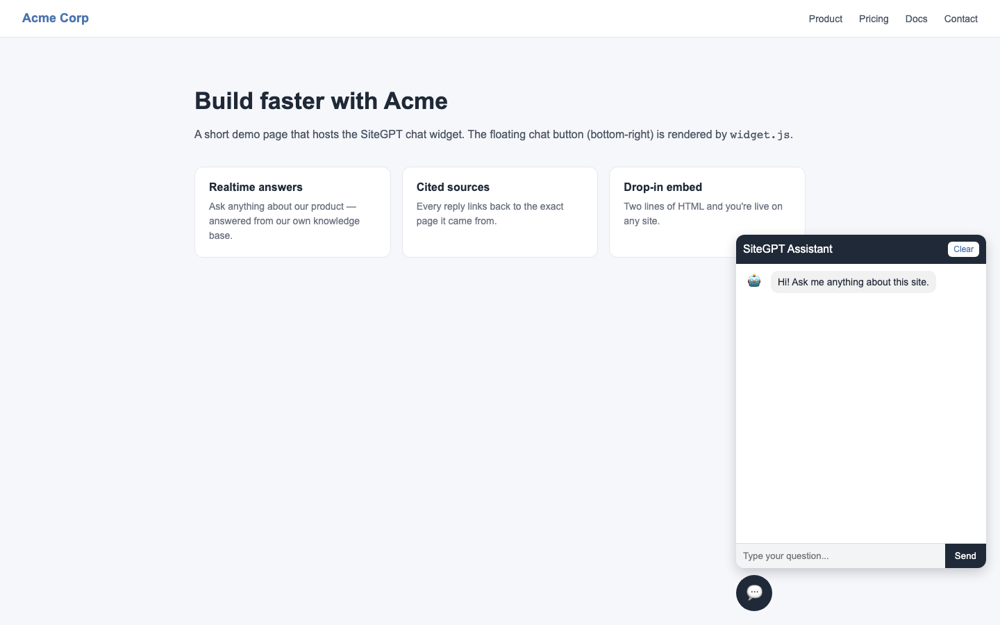
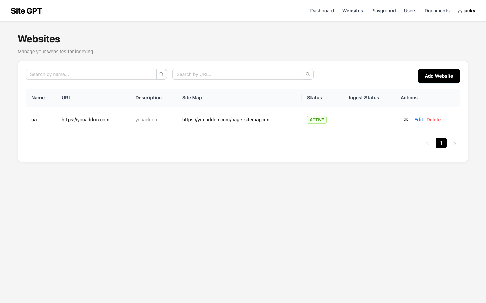
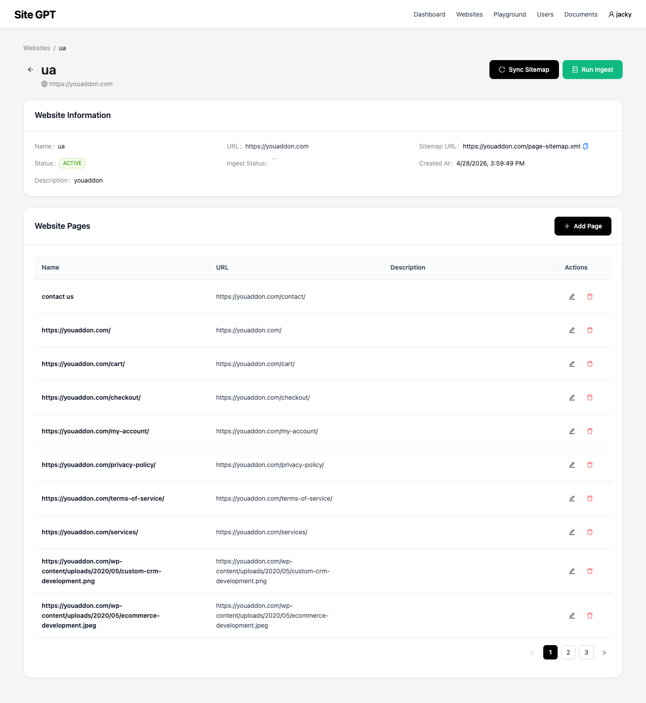
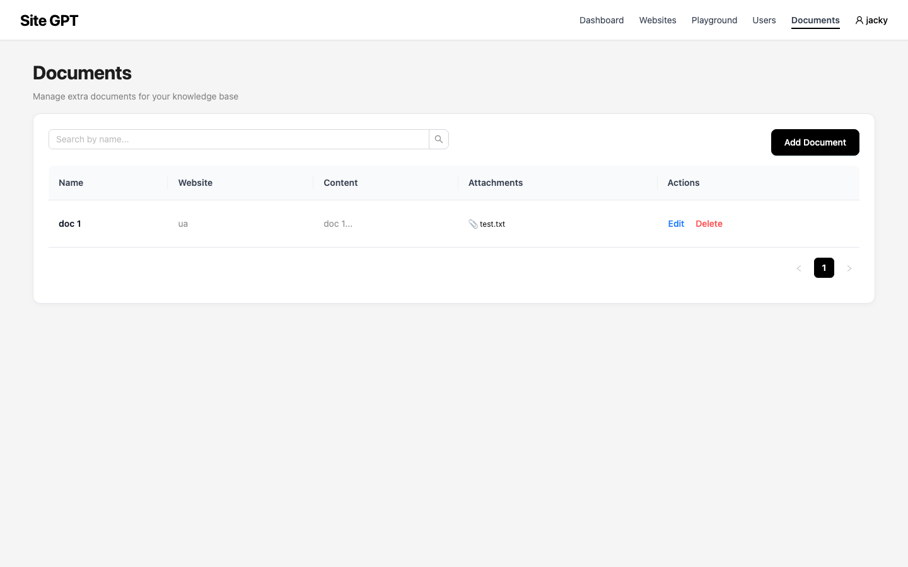
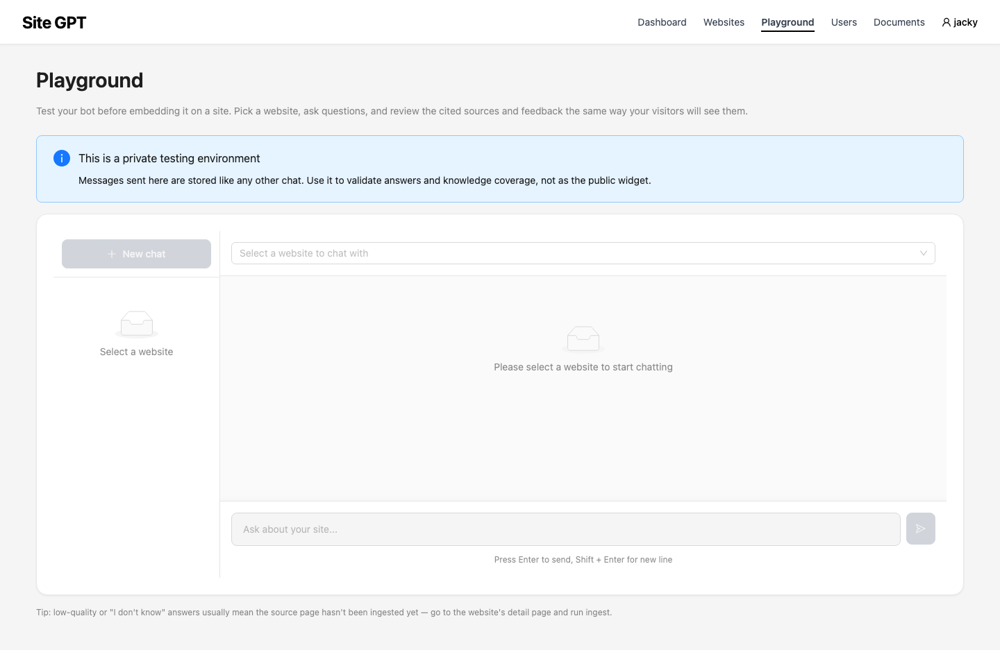
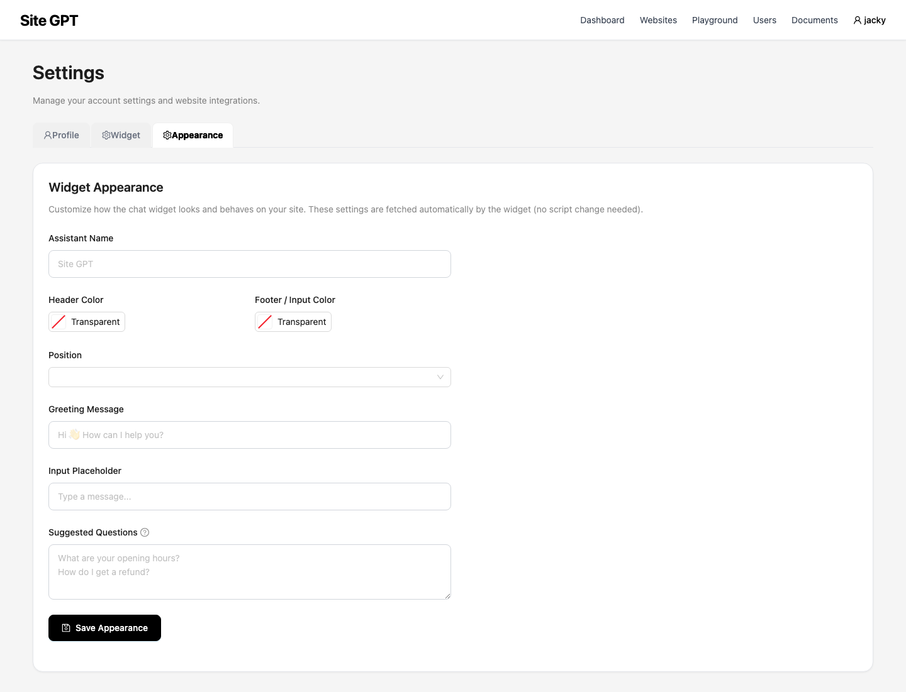
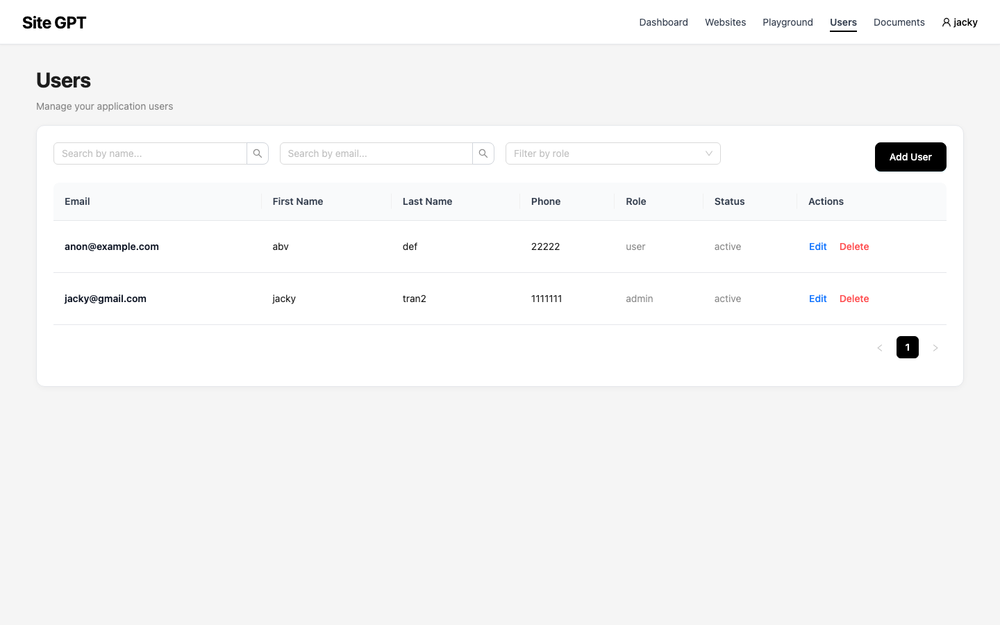

# SiteGPT

Turn any company website + extra documents into an embeddable AI chat bot (RAG).

## Screenshots

<table>
  <tr>
    <td width="50%"></td>
    <td width="50%"></td>
  </tr>
  <tr>
    <td align="center"><b>Dashboard</b> — stat cards, recent conversations, sites &amp; team</td>
    <td align="center"><b>Embeddable widget</b> — drops onto any site with two lines of HTML</td>
  </tr>
  <tr>
    <td></td>
    <td></td>
  </tr>
  <tr>
    <td align="center"><b>Websites</b> — manage crawled sources</td>
    <td align="center"><b>Website detail</b> — pages, sync sitemap, run ingest</td>
  </tr>
  <tr>
    <td></td>
    <td></td>
  </tr>
  <tr>
    <td align="center"><b>Extra documents</b> — uploads join the knowledge base</td>
    <td align="center"><b>Playground</b> — test answers with citations &amp; feedback</td>
  </tr>
  <tr>
    <td></td>
    <td></td>
  </tr>
  <tr>
    <td align="center"><b>Settings · Appearance</b> — colors, greeting &amp; suggested questions (fetched by the widget)</td>
    <td align="center"><b>Users</b> — manage team &amp; roles</td>
  </tr>
</table>

## How it works

1. Register company → creates company + admin user
2. Add website (URL + sitemap) → add/select pages → `POST /api/ingest`
3. Worker crawls pages (`trafilatura`), chunks (1000/200), embeds, stores in `pgvector`
4. Extra documents (text/file uploads in `uploads/`) are ingested the same way
5. Chat: `POST /api/chat` → embed question → pgvector similarity search (top 5) → LLM answers with context + last 10 chat messages
6. Embed on any site via `GET /widget.js`

## Tech stack

- **Backend:** FastAPI, SQLAlchemy, Alembic, pgvector, Redis (queue), JWT (`python-jose`), multi-LLM via LangChain (`ollama` / `openai` / `custom_openai` / `gemini` / `groq` / `openrouter`)
- **Frontend:** React 18 + Vite + TypeScript + Ant Design + axios + react-router
- **Infra:** PostgreSQL + pgvector, Redis, Ollama (default local LLM)

## Repo structure

```
src/site_gpt/app/
  main.py              # FastAPI app + router wiring
  api/                 # routes.py (auth/chat/ingest/widget), company, user, website, document, extra_document, setting, upload
  models.py            # Company, User, Website, WebsitePage, Document, ExtraDocument, Attachment, Embedding, ChatMessage, Setting
  schemas/             # Pydantic request/response per resource
  services/            # llm.py, rag.py, ingest.py, crawler.py, redis.py, mail.py
  core/                # config.py (env), auth.py (hash/JWT)
  db/                  # session.py, base.py, vector_store.py
  scripts/widget.js    # embeddable chat widget (window.ChatWidgetConfig)
  worker.py            # Redis queue consumer (ingest jobs)
frontend/src/
  pages/ (Dashboard, Websites, WebsiteDetail, ExtraDocuments, Users, Settings, Login, Register)
  components/ (Layout, Chat, WebsiteTable, CompanyTable, UserTable)
  context/ (AuthContext, ChatContext), utils/api.ts, types/api.ts
alembic/                # DB migrations
uploads/                # uploaded attachment storage
```

## Prerequisites

- Python 3.13 + `uv`, Node 18+, PostgreSQL with `pgvector` extension, Redis, Ollama (or any LLM API key)

## Setup — backend

```bash
cp .env.example .env   # fill DATABASE_URL, LLM_*, REDIS_*, MAIL_*
uv venv --python 3.13 && source .venv/bin/activate
uv sync
uv run alembic upgrade head
uv run uvicorn site_gpt.app.main:app --reload        # API :8000
uv run python -m site_gpt.app.worker                 # ingest worker (separate terminal)
```

## Setup — frontend

```bash
cd frontend
echo "VITE_BACKEND_URL=http://localhost:8000" > .env
npm install && npm run dev   # :5173
```

## Env vars

| Key | Default | Purpose |
|---|---|---|
| `DATABASE_URL` | — | SQLAlchemy Postgres URL |
| `LLM_AI` | `openai` | `ollama\|openai\|custom_openai\|gemini\|groq\|openrouter` |
| `LLM_MODEL` | `gpt-4o-mini` | chat model |
| `LLM_EMBEDDING_MODEL` | `text-embedding-3-small` | embedding model |
| `OPENAI_API_BASE_URL` / `OPENAI_API_KEY` | — | OpenAI or Ollama-compatible endpoint |
| `GEMINI_API_KEY` / `GROQ_API_KEY` / `OPEN_ROUTER_API_KEY` | — | provider keys |
| `OLLAMA_HOST` / `OLLAMA_USERNAME` / `OLLAMA_PASSWORD` | `http://localhost:11434` | Ollama (optional basic auth) |
| `REDIS_HOST` / `REDIS_PORT` / `REDIS_PASSWORD` / `REDIS_DB` | `localhost/6379` | job queue |
| `MAIL_*` | — | forgot/reset password via fastapi-mail |
| `JWT_SECRET_KEY` | dev default | **change in prod** |
| `VITE_BACKEND_URL` (frontend) | — | backend base URL |

## Key API endpoints

- `POST /api/register` — create company + admin user
- `POST /api/token` — login → JWT
- `POST /api/ingest?website_id=` — enqueue crawl+embed job
- `POST /api/chat` — `{website_id, session_id, question}` → `{answer, sources}`
- `GET /widget.js` — embeddable widget
- `POST /api/chat/feedback` — public 👍/👎 rating `{website_id, session_id, rating, comment?}`
- `GET /api/widget-config?website_id=` — public widget appearance/config (assistant name, colors, greeting, placeholder, position, suggested questions)
- `GET /health`
- `/api/companies`, `/api/users` (+`/me`, `/forgot-password`, `/reset-password`), `/api/websites` (+`/{id}/pages`, `/{id}/load-site-map`), `/api/documents`, `/api/extra_documents`, `/api/settings`, `/api/uploads`

## Embed widget

```html
<script>
  window.ChatWidgetConfig = { apiUrl: 'http://localhost:8000', website_id: '<WEBSITE_ID>' };
</script>
<script src="http://localhost:8000/widget.js"></script>
```

## Dev commands

```bash
uv run alembic revision --autogenerate -m "[name]" && uv run alembic upgrade head
cd frontend && npm run build && npm run lint
```

## Embedding dimension caveat

The `embeddings` table column is `Vector(1536)` (matches OpenAI `text-embedding-3-small`).
If you switch `LLM_AI` to **ollama** with an embedding model that outputs a different
dimension (e.g. `nomic-embed-text` → 768), ingestion will fail on insert. Either keep a
1536-dim embedding model, or change the column dimension + `Embedding.embedding` in
`models.py` to match and regenerate a migration.

## Fixes & improvements applied

- **RAG now answers from uploaded documents too.** `services/rag.py::search` previously
  only queried `documents` (crawled pages). It now UNIONs `embeddings` from both
  `documents` (by `website_id`) and `extra_documents` (by `website_id` **or** company), so
  the chatbot actually uses the knowledge users upload.
- **Ingestion no longer crashes.** `crawler.crawl_page` now returns `(title, text)`, fixing
  the `KeyError: 'title'` that broke every ingest job in `worker.py`. The worker also
  upserts pages by URL (no more duplicate growth) and is wrapped in error handling that sets
  `ingest_status = 'failed'` on error.
- **Uploaded files are now searchable.** New `services/parse.py` extracts text from
  `.txt/.md/.csv/.json/.html/.pdf/.docx` and the worker embeds both the extra-document text
  **and** its attachment contents (added `pypdf` + `python-docx` deps).
- **Re-ingest is idempotent.** `ingest_document` / `ingest_extra_document` drop existing
  chunks before re-embedding, so re-running ingest won't duplicate vectors.
- **`POST /api/ingest` is now protected** — requires a manager/admin token and ownership of
  the website (was fully public).
- **Settings are scoped per company** — `GET/PUT /api/settings` no longer leaks or edits
  other companies' settings.
- **Upload safety** — files are stored under a UUID name (collision- and path-traversal-safe)
  instead of the raw filename.
- **Forgot/reset password fixed & secured** — old flow overwrote the live password with a
  garbage hash and sent no email. Now `forgot-password` issues a 30-min token, emails a
  reset link (`FRONTEND_URL`), and `reset-password` verifies the token + expiry. Added
  `reset_token` / `reset_token_expires_at` columns (migration `3f1a9c0d7e22`).
- **CORS** — `allow_credentials` is auto-disabled when `CORS_ORIGINS=*`
  (browsers reject the wildcard+credentials combo). Set an explicit origin list in prod.
- **Dead dual embedding backend removed** — dropped `db/vector_store.py` + unused
  `ingest_documents` (langchain-postgres `PGVector`) to avoid a second, divergent vector
  store.
- **Chat prompt** — `ask()` now uses a system instruction to answer only from context and
  say it lacks the info otherwise.

## Enhancements added

- **Streaming chat (SSE).** New `POST /api/chat/stream` streams the answer token-by-token
  (`data: {"chunk": "..."}` then `data: {"done": true}`). `rag.py::ask_stream` offloads
  embedding/search/DB writes to a thread so the event loop stays responsive. The in-app
  `ChatContext` and the public `widget.js` both consume the SSE stream (the widget was also
  fixed — it previously did a `GET` that never matched the `POST` backend). The legacy
  `POST /api/chat` is kept for non-streaming callers.
- **Stale-chunk cleanup.** On ingest, documents whose URL is no longer in the successfully
  crawled active-page set are deleted (cascading their embeddings). Extra documents with no
  usable content have their embeddings dropped, so removed/empty sources stop surfacing.
  Guarded so a full crawl failure can't wipe a site's knowledge base.
- **Rate limiting.** `services/ratelimit.py` (in-memory fixed window, per client IP) caps
  `/api/chat` + `/api/chat/stream` at 20 req/min and `/api/ingest` at 10 req/min (429 on
  exceed). Swap for a Redis counter if you run multiple workers.
- **Periodic re-crawl.** The worker now runs a `scheduler_loop` that, every
  `CRAWL_REFRESH_HOURS` (default 24, set `0` to disable), re-enqueues ingest for websites
  whose `ingest_status == 'completed'` and last update is older than the interval — keeping
  the knowledge base fresh with no extra infra.

## Further hardening (latest round)

- **Default settings are auto-seeded on register.** `POST /api/register` now creates the
  company's default `Settings` (`assistant_name`, `widget_header_color`,
  `widget_footer_color`) so the admin/settings panel is usable immediately — no separate
  "create settings" step required.
- **`POST /api/settings` is now idempotent.** It only inserts the default rows whose key is
  missing for the company, so calling it repeatedly never produces duplicate settings
  (previously it blindly `add_all`'d and could stack rows). Returns `created` / `skipped`
  counts.
- **Deleting a page removes its knowledge immediately.** `DELETE
  /api/websites/{id}/pages/{page_id}` now also deletes the matching `Document` (and its
  embeddings via the FK `ON DELETE CASCADE`) by URL+website, so a removed page stops being
  answered by the bot without waiting for a re-ingest.
- **`GET /health` is a real probe.** It opens a DB connection (`SELECT 1`) and pings Redis;
  the response now reports `{"status": "ok"|"degraded", "db": bool, "redis": bool}` so an
  orchestrator/load-balancer can detect a backend that can't reach its dependencies (instead
  of a blind `{"status":"ok"}`).
- **SQL echo is off by default.** `db/session.py` uses `echo=SQL_ECHO` (env, default
  `false`) instead of a hard-coded `echo=True`, so production logs are no longer flooded with
  every SQL statement. Set `SQL_ECHO=true` to debug queries.

## Chat UX enhancements (citations, feedback, playground, widget config)

- **Citations in answers.** `services/rag.py::search` now returns each chunk's
  `title`/`url`/`source_type` (crawled page vs. uploaded document). Both
  `POST /api/chat` (`{answer, sources}`) and the SSE `done` event
  (`{done: true, sources: [...]}` from `/api/chat/stream`) surface them, so the
  in-app chat, the Playground, and the public `widget.js` can all render "Sources".
- **Answer feedback.** New `chat_feedback` table + `POST /api/chat/feedback`
  (public, rate-limited) records 👍/👎. The in-app chat and the widget both show
  feedback buttons under each bot reply.
- **Playground page.** New admin route `/playground` reuses the in-app chat to
  test the bot (with citations + feedback) before embedding it.
- **Widget appearance via Settings.** `GET /api/widget-config?website_id=` is a
  public endpoint the widget fetches to apply `assistant_name`, `widget_header_color`,
  `widget_footer_color`, `widget_position`, `greeting_message`, `placeholder_text`, and
  `suggested_questions`. These are seeded as default `Settings` rows on register (the
  `PUT /api/settings` upsert also creates any missing key for older companies), and
  editable from the new **Appearance** tab in Settings. The embed script no longer
  hardcodes colors/name — it only needs `website_id` + `apiUrl`.

## Chat streaming fix (SSE error)

The streaming chat (`POST /api/chat/stream`) was failing in the browser with
`ERR_INCOMPLETE_CHUNKED_ENCODING` / "network error". Three issues were fixed:

- **Stream never breaks.** `services/rag.py::ask_stream` is now wrapped so any failure
  (embedding API error, DB error, LLM error) emits `data: {"error": ...}` followed by
  `data: {"done": true}` instead of raising inside the generator (which closed the chunked
  response early). The full traceback is logged server-side; the client only gets a short,
  secret-free message. Both clients (`frontend/src/context/ChatContext.tsx` and
  `src/site_gpt/app/scripts/widget.js`) now render that `error` event.
- **Embeddings work with OpenAI-compatible gateways.** LangChain's `OpenAIEmbeddings` wrapper
  POSTs a request shape some gateways (e.g. a local router at a custom `OPENAI_API_BASE_URL`)
  reject with `400 input is required`. `services/llm.py` now uses a thin
  `_OpenAICompatibleEmbeddings` class that calls the OpenAI SDK directly. It also requests
  `dimensions=1536` for `auto` / `text-embedding-3-*` models, so vectors match the
  `Vector(1536)` column (the `auto` router otherwise returns 3072-dim vectors).
- **Vector double-wrapping bug.** `ask_stream` passed `embed_texts([question])`
  (a list-of-lists) into `search()` without the `[0]` unpack the sync `ask()` does, so the
  pgvector query became `[[...]]` and failed with `invalid input syntax for type vector`.
  Fixed by unpacking the single vector.

After these fixes, chat streams real tokens end-to-end. **Note:** because embeddings were
failing before, no vectors exist yet — ingest/crawl a website (settings → pages →
`POST /api/ingest`) so the bot actually has knowledge to answer from.
